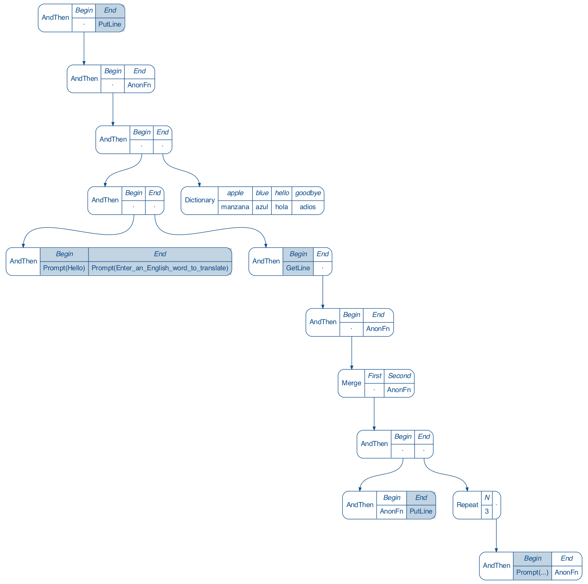

# Free Arrow

[](https://circleci.com/gh/adrielc/free-arrow/tree/master)
[](https://codecov.io/gh/adrielc/free-arrow)

Implementation of the Free Arrow in Scala and other helpful tools for working with Arrows

Based on the paper [Generalizing Monads to Arrows](http://www.cse.chalmers.se/~rjmh/Papers/arrows.pdf)

Use Free Arrow (`FreeA[R, F, A, B]`) to build a computation graph for any context `F[A, B]`. Typically `FreeA` is used to compose
values of some embedded DSL `F[A, B]` into a flow-like computation graph.

The primary motivation for using `FreeA` is to decouple the construction of a program
from its interpretation, enabling the following features:

-  Create reusable and modular components to build complex programs from simpler ones
-  Change the program's interpretation without altering its structure
-  Statically introspect the graph to describe the flow
-  Optimize/rewrite a program using results from its analysis

An example use case may be creating a data processing flow which can 
be used both as a stand alone function for single data points or
as a stream processor. With Free Arrow, you would write the flow logic 
once, and have two interpreters; one for a pure function and a second 
for the stream processor.

### Example

First define a minmal set of operations (algebra)

```scala

sealed trait ConsoleOp[A, B]
case object GetLine                 extends ConsoleOp[Unit, String]
case object PutLine                 extends ConsoleOp[String, Unit]
case class Prompt(message: String)  extends ConsoleOp[Unit, Unit]
case class Dictionary(dict: Map[String, String]) extends ConsoleOp[String, Option[String]]

``` 

Then define smart constructors to lift your algebra into the FreeArrow


```scala
import FreeA.liftK // for lifting `F[A, B]` to `FreeA`

val getLine = liftK(GetLine)
val putLine = liftK(PutLine)
def prompt(message: String) = liftK(Prompt(message))
def dictionary(entry: (String, String)*) = liftK(Dictionary(entry.toMap))

```  

Construct a program from your free operations 

```scala

val translator = 
    prompt("Hello") >>>
    prompt("Enter an English word to translate") >>>
    getLine >>| ( // dead end, return output of `getLine` after the following
        putLine.lmap("Translating " + (_: String)) >>>
        prompt("...").rmap(_ => Thread.sleep(1000)).loopN(3)
      ) >>>
    dictionary(
      "apple" -> "manzana",
      "blue" -> "azul",
      "hello" -> "hola",
      "goodbye" -> "adios")
      .rmap(_.getOrElse("I don't know that one")) >>>
    putLine

```

Write an interpreter to do something useful with your program

```scala

val functionInterpreter: ConsoleOp ~~> Function1 = new (ConsoleOp ~~> Function1) {
  override def apply[A, B](f: ConsoleOp[A, B]): A => B = f match {
    case Prompt(message) => _ => println(message)
    case GetLine => _ => StdIn.readLine()
    case PutLine => println
    case Dictionary(dict) => dict.get
  }
}

```

Interpret and run your program

```scala

val program = translator.foldMap(functionInterpreter)

program(())

// Hello
// Enter an English word to translate
// Translating hello
// ...
// ...
// ...
// hola
```

Here's an example of introspecting the FreeArrow program to count the 
number of getLines used

```scala

import cats.implicits._

val numGets = translator.analyze(new (ConsoleOp ~>| Int) {
  def apply[A, B](f: ConsoleOp[A, B]): Int = f match {
    case GetLine => 1
    case _ => 0
  }
})

```

It is also possible to generate documentation from your free program.
Here is the output of an interpreter that draws a computation graph. 


 
### Other Features:

FreeA is implemented as a sealed trait that supports operations from several levels of the Arrow
typeclass hierarchy. 
    
The typeclass required to run/interpret a FreeA is inferred by the operations
used to build it. Only the most general and least powerful Arrow subtype will be required.

```scala

val unit: FreeA[Arrow,      Nothing, Unit, Unit]                = FreeA.id[Unit]

val ar: FreeA[Arrow,        Nothing, Unit, Unit]                = unit >>> unit

val ac: FreeA[ArrowChoice,  Nothing, Either[Unit, Unit], Unit]  = ar ||| ar

val az: FreeA[ArrowZero,    Nothing, Unit, Unit]                = ar >>> zeroArrow[Unit, Unit]

val ap: FreeA[ArrowPlus,    Nothing, Unit, Unit]                = az <+> ar <+> ar

// val run = ap.foldMap(BiFunctionK.id[Function1]) // wont compile, 
// `Function1` does not have an ArrowPlus instance

val run = ap.foldMap(BiFunctionK.id[Function1].kleisli[List]) // compiles
// Any Kleisli[M, A, B] that has a Monad[M] and MonoidK[M] has an ArrowPlus[Kleisli[M, ?, ?]] instance

run(()) // List((), ())

```    

Different DSLs and their interpreters can be composed together in `FreeA` using 
 `FreeA.inl`/`FreeA.inr` and the `BiFunctionK.or` combinators respectively.
    
   - e.g. A `FreeA[R, ConsoleOp, A, B]` and a `FreeA[R, MathOp, A, B]` can be combined to a
    `EitherFreeA[R, ConsoleOp, MathOp, A, B]`
    
### Type Classes Supported by FreeA


 ### Free Comparison
 
As Free constructions go, here's how `FreeA` sits on the spectrum of power and expressiveness:

(Co)Yoneda < Free Applicative < Free Arrow < Free Monad

Free Arrow has both the static introspection of the Free Applicative and the sequencing capability of the Free Monad

FreeArrow supports both sequencing like FreeMonad and static analysis
of the free structure like FreeApplicative. This allows you to write 
expressive programs that can be introspected and optimized for further
sequential composition

### Credits

Based on the talks [Beyond Free Monads](https://www.youtube.com/watch?v=A-lmrvsUi2Y) and [Blazing Fast, Pure Effects without Monads](https://www.youtube.com/watch?v=L8AEj6IRNEE) by John A De Goes

The ZIO arrow module has been adapted from the work in https://github.com/zio-crew/zio-arrow. Only main difference that the code in this repo has is that
Impure function compisition is made stack safe.


### Usage

Add this to your `build.sbt`:

```scala
libraryDependencies += "com.adrielc" %% "free-arrow" % "<version>"
```

Cross-builds are available for Scala 2.12.10 and 2.13.1.

### Community

Any contribution is more than welcome. Also feel free to report bugs, request features using github issues.

People are expected to follow the [Scala Code Of Conduct](https://www.scala-lang.org/conduct/) when discussing free-arrow on the Github page, Gitter channel, or other venues.

### Maintainers

* [adrielc](https://github.com/adrielc)

### License

MIT License

Written in 2020 by [Adriel Casellas](https://github.com/adrielc).
